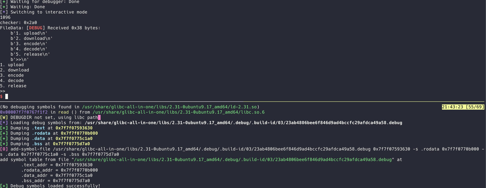

# GLIBC-ALL-IN-ONE-GDB-DEBUG

A powerful GDB extension script that automatically adds debug symbols for ELF binaries using [glibc-all-in-one](https://github.com/matrix1001/glibc-all-in-one).

<p align="center">
  
</p>


## Features

- **Automatic Debug Symbol Loading**: Automatically detects and loads appropriate debug symbols when a process is attached
- **Colored Output**: Enhanced terminal output with color-coded information for better readability
- **Section Detection**: Automatically identifies and maps important sections (.text, .rodata, .data, .bss)
- **Flexible Configuration**: Supports custom debug symbol paths and configurable behavior

## Installation

```bash
# Clone the repository to your local directory
mkdir -p ~/.local/
git clone https://github.com/MuelNova/glibc-all-in-one-gdb-debug.git ~/.local/glibc-all-in-one-gdb-debug

# Add to your GDB configuration

# Optional: Set default debug symbols directory
# echo "set \$DEBUGDIR=\"/usr/share/glibc-all-in-one/libs/2.31-ubuntu9_amd64/.debug\"" >> ~/.gdbinit

# Optional: Enable automatic debug symbol loading (recommended)
echo "set \$FETCH_DEFAULT=1" >> ~/.gdbinit

echo "source ~/.local/glibc-all-in-one-gdb-debug/script.py" >> ~/.gdbinit
```

## Usage

Once installed, you can use the `fetch-debug` command in GDB to manually load debug symbols:

```
(gdb) fetch-debug [PATH]
```

If you've enabled automatic loading with `$FETCH_DEFAULT=1`, debug symbols will be loaded automatically when you attach to a process.

### Command Details

```
fetch-debug - Fetch and set glibc debug info, especially for glibc-all-in-one

Usage:
    fetch-debug [PATH]

Argument:
    [PATH] - PATH to search for debug symbols. If not provided:
             1. Uses $DEBUGDIR if set
             2. Falls back to "{ELF_libc_path}/.debug" directory

Example:
    fetch-debug /usr/share/glibc-all-in-one/libs/2.31-ubuntu9_amd64/.debug
```

## Configuration Options

You can customize the behavior by setting these variables in your `.gdbinit` file or during a GDB session:

| Variable | Description | Default |
|----------|-------------|---------|
| `$DEBUGDIR` | Path to search for debug symbols | None |
| `$FETCH_DEFAULT` | Automatically load debug symbols when attaching to a process | None (Disabled) |

## Integration with glibc-all-in-one

This tool is designed to work seamlessly with the [glibc-all-in-one](https://github.com/matrix1001/glibc-all-in-one) project, which provides prebuilt glibc libraries for various versions. To get the most out of this tool:

1. Install glibc-all-in-one:
   ```bash
   git clone https://github.com/matrix1001/glibc-all-in-one.git
   cd glibc-all-in-one
   ./download 2.31-ubuntu9_amd64  # Replace with your desired version
   ```

2. Set the debug directory in your `.gdbinit`:
   ```
   set $DEBUGDIR="/path/to/glibc-all-in-one/libs/2.31-ubuntu9_amd64/.debug"
   ```

   or temporarily set the debug direcorty:
   ```
   fetch-debug /path/to/glibc-all-in-one/libs/2.31-ubuntu9_amd64/.debug
   ```

## Troubleshooting

### Debug Symbols Not Loading

If debug symbols aren't loading correctly:

1. Verify the debug symbols exist in the specified path
2. Check that the ELF binary's libc version matches the debug symbols
3. Run `fetch-debug` manually with the correct path
4. Check GDB output for specific error messages

### Permission Issues

If you encounter permission errors:

```bash
# Make sure the script is executable
chmod +x ~/.local/glibc-all-in-one-gdb-debug/script.py
```

## Contributing

Contributions are welcome! Feel free to submit issues or pull requests to improve this tool.

## License

This project is open source and available under the [MIT License](LICENSE).
